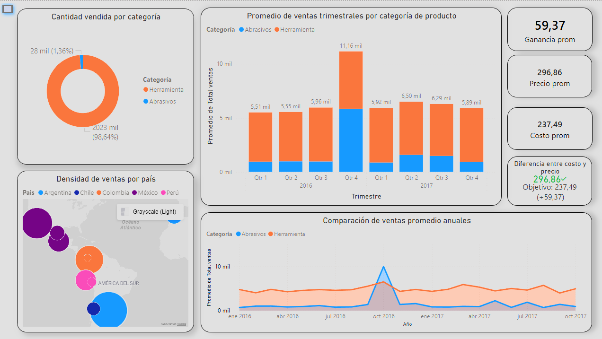
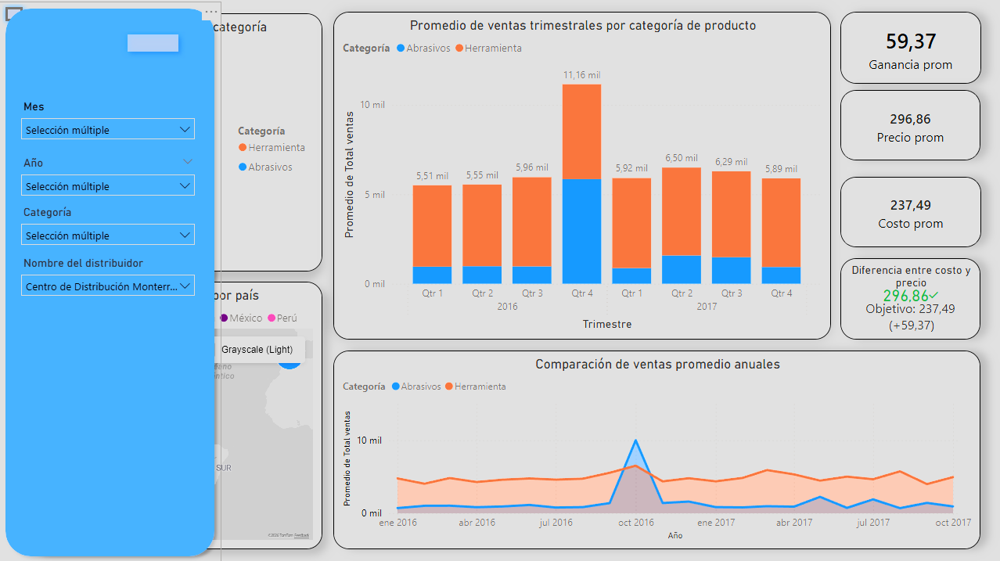

A continuación se presentara un ejercicio de análisis dentro de Power BI  

Dashboard de ventas generado en POWER BI

En este caso se presenta el mismo Dashboard, pero en este caso se abre mediante un boton el menú para seleccionar diferentes filtros

